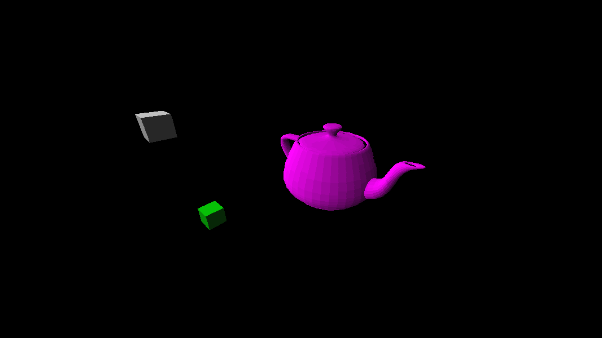
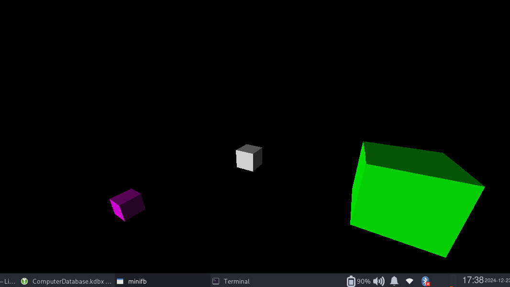
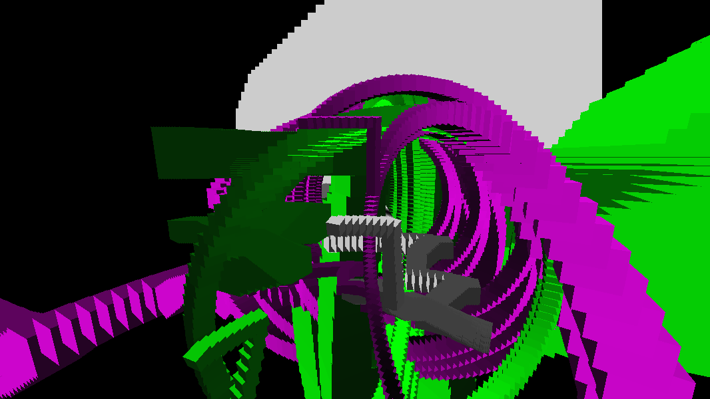
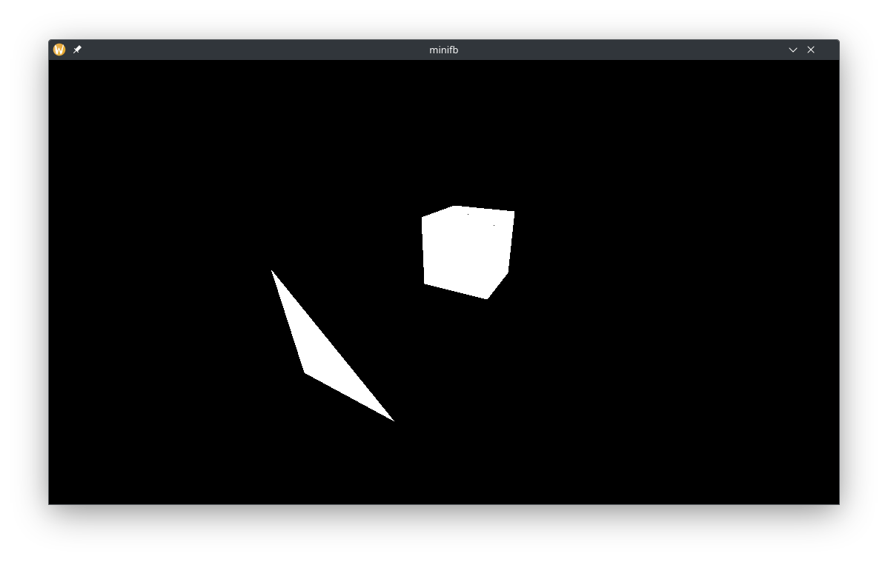

**This is a WIP project**

### Description 
This is a simple  software implementation of a GPU.
You have to provide it a Vertex and an Index buffer and write a vertex and fragment shader for it. 

### How to run and Dependencies
You have to have `my-math` repo from my github in the same directory as `my-gpu`.
Then simply run:
``` cargo test --realease ```

### Implementation Details 
The GPU implements near plane and screen edge clipping to improve performance. It also implements a Z or a Depth buffer.

It uses my own math library for the vector and matrix math. The only dependency that's not mine is minifb which handles the opening of the window and renders a pixel buffer to the screen.

### Screenshots




